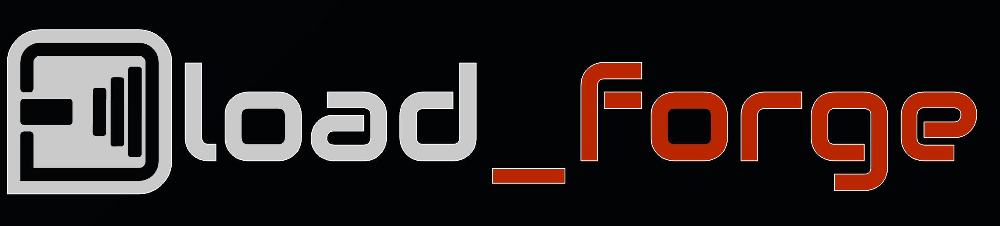

# Load Forge

<p align="center">
  
</p>

Load Forge is a Streamlit simulator for acoustic loudspeaker loads.  It supports
**DCCAV** / double resonator in series, **fourth-order bandpass**, conventional
**bass reflex**, **acoustic suspension** (sealed box) and ideal **infinite baffle**, all derived
from driver Thiele/Small parameters.

The app starts from a T/S set, proposes an editable first-pass alignment, then
simulates the lumped acoustic circuit and plots:

- estimated total SPL
- driver and port contributions when present
- cone excursion
- electrical impedance
- port volume velocity for ported loads
- MIL/MOL limit curves when `Xmax` or `Pe` are available

The current model is a frequency-domain engineering simulator.  It is useful
for comparing alignments and understanding trends; it is not a calibrated
far-field measurement substitute.

Current UI highlights:

- separate `Design a box` and `Find a driver` workspaces
- one optimizer behind every automatic box: a `Max extension` / `Balanced` /
  `Flattest` / `Manual` strategy control instead of overlapping alignment modes
- response, excursion, impedance, ports and group-delay design tabs
- explicit response frequency-window zoom with automatic vertical fit and reset
- response pinning for A/B overlays
- one-click comparison across all five loads at equal volume
- preset save/load and URL-based sharing grouped in the `Project` menu
- port-geometry estimates and chuffing diagnostics
- driver reference metrics, voice-coil corner and T/S-based bandwidth class
- goal-first driver ranking with strict catalog filters, candidate preview,
  a three-step sidebar workflow, explicit apply, practical quick-scan defaults,
  response sparklines and CSV
  export
- progressive disclosure for T/S data, sweep settings, cursor positions and
  secondary result metrics

Retail prices in `data/driver_prices.json` can be refreshed concurrently from
SoundImports, Blue Aran, Madisound and Parts Express with
`tools/run_price_enrichment_cycle.py`.  The four providers run concurrently
against independent checkpoints under `io/price_shards/`; a locked atomic merge
updates the shared JSON only after their enrichment windows finish.

## Running it

```bash
make install
make run
```

`make run` starts Streamlit headless on `localhost:8501` and opens Safari.  You
can also run it directly:

```bash
.venv/bin/streamlit run ui_app.py
```

## Load Models

The simulated topology is:

```text
driver -> upper volume || upper port -> lower volume || lower port
```

The upper chamber `Vh` is tuned to `fh`; its port discharges into the lower
chamber `Vl`, which is tuned to `fl` and vents to the outside.

The first-pass alignment is:

```text
Vh = 2.05 * Qts^2 * Vas
Vl = 4.13 * Qts^2 * Vas
fh = 1.22 * Fs / Qts
fl = 0.466 * Fs / Qts
f3 = 0.83 * fl
```

The simulator solves the acoustic impedance network with complex arithmetic and
uses the driver T/S data to derive missing `Mms`, `Cms`, `Rms`, `Qes` and `Bl`
when measured values are not supplied.

The normal bass-reflex path uses:

```text
driver -> box volume || vent
```

Its automatic starting point is intentionally conservative: `Vb = Vas` and
`Fb = Fs`, with manual controls for final tuning.

The fourth-order bandpass encloses the cone between a sealed rear chamber and
a vented front chamber; only the front vent radiates. Its starter exposes
`Vs`, `Vp` and `Fp`, with the same optimizer/Finder/project workflows.

The acoustic-suspension path uses a closed `Vb` and reports its classical
`Fc` and `Qtc`; its starter targets `Qtc=0.707` when the driver's `Qts` permits.
Infinite baffle has no box or tuning controls and assumes perfect isolation of
the rear wave.

Simulation controls also include an optional `Series R (ohm)` so amplifier
output impedance, cable resistance and crossover DCR can be included in the
drive, damping and impedance estimate.

## Project Structure

```text
ui_app.py          Streamlit dashboard
src/dccav.py       public facade for all acoustic-load models
docs/dccav.md      module contract and formulas
tests/test_all.py  custom test runner, including acoustic-load tests
```

## Tests

Targeted acoustic-load checks:

```bash
.venv/bin/python tests/test_all.py -m dccav
```

Full active suite:

```bash
.venv/bin/python tests/test_all.py
```

For UI changes, run a Streamlit `AppTest` that loads `ui_app.py` and asserts no
exceptions.

## Development Contract

The repo follows the local contract in `AGENTS.md` and `GOLDEN_STD.md`:

- every `src/*.py` change must update its matching `docs/<module>.md`
- new or changed behavior needs tests in the same change
- run targeted tests while patching
- run the full active suite before any commit touching Python
- do not push unless explicitly requested
