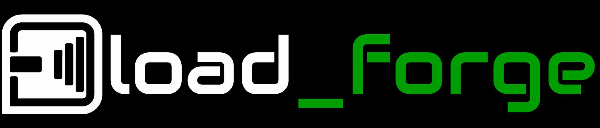

# Load Forge

<p align="center">
  
</p>

**Multi-Topology Acoustic Load Design & Optimizer** · Version **0.16.3**
=============================================================================
[](VERSION)
[](https://github.com/marcoderossi/load_forge/actions)

Current release: **0.16.3**

Load Forge is a Streamlit simulator for acoustic loudspeaker loads.  It supports
**DCCAV** / double resonator in series, **fourth-, sixth- and eighth-order bandpass**,
conventional **bass reflex** with either a vent or passive-radiator resonator,
**acoustic suspension** (sealed box) and ideal **infinite baffle**, all derived from driver
Thiele/Small parameters.

The app starts from a T/S set, proposes an editable first-pass alignment, then
simulates the lumped acoustic circuit and plots:

- estimated total SPL
- driver and port contributions when present
- cone excursion
- electrical impedance
- port volume velocity for ported loads
- MIL/MOL limit curves when `Xmax` or `Pe` are available

The current model is a frequency-domain engineering simulator.  It is useful
for comparing alignments and understanding trends; it is not a calibrated
far-field measurement substitute.

Current UI highlights:

- a first-class `Community` directory, linked directly from the project header,
  for browsing public projects with keyword/topology search and parametric
  ranges for Vb, Fb, driver diameter, Fs, Qts and F3; result cards expose the
  relevant engineering values and open the immutable technical snapshot
- separate `Design a box` and `Bass Match` workspaces selected through large,
  directly clickable branded tabs
- compact 3+3 load picker whose illustrated cards are directly clickable,
  with labels beneath the diagrams, keyboard focus and an emerald checked active state
- a black sidebar and unified emerald primary-action palette across workspace
  selection, load cards, Run controls, response traces and actionable guidance;
  secondary instruction bands use neutral gray
- a killer-feature-first `Bass Match` workspace: define the bass brief, run one
  optimized driver/load/box search, then open a winning design in Box Design;
  its brief shows every operative enclosure, performance, driver, library and
  evaluation constraint in a compact grid, while counts and the action stay in
  one row; completion uses a non-layout toast, the active scan gets a prominent
  full-width progress bar and ranked matches scroll inside a fixed-height table
  so the normal workspace does not grow beyond the viewport; the raw catalog
  stays secondary as a collapsible candidate pool; the former Finder
  `Desired F3` soft optimizer preference is removed because it did not act as
  a dependable ranking constraint, while
  reference SPL, driver configuration, T/S validity and required Xmax reduce
  the simulation queue before the enclosure solver starts; duplicate physical
  models prefer the Load Forge catalog, then price, and the ranking retains
  only the best load for each driver
- a `Ports → Resonator type` submenu for choosing a vent or passive radiator
  without misclassifying the radiator as a separate acoustic load
- one optimizer behind every automatic box: a `Max extension` / `Balanced` /
  `Flattest` / `Manual` strategy control instead of overlapping alignment modes
- contextual response, excursion, impedance, ports, group-delay and atlas tabs;
  Ports is omitted for sealed/infinite-baffle loads, while Atlas is omitted for
  infinite baffle and the passive-radiator resonator
- compact automatic F3/F6/F10 markers, an explained design-health score and
  secondary downloads grouped under `Export design`; each editable design tab
  now exposes its own CRW download for unambiguous AP export
- explicit response frequency-window zoom with automatic vertical fit and reset
- a compact 420 px main response chart that keeps its controls above the fold
  on desktop viewports; the redundant active-load heading is omitted because
  the editable design tab and sidebar already identify the current design
- Editable design comparisons for every account tier: select 2–8 ranked Bass Match results or
  duplicate the active Box Design; each design gets its own tab, keeps a
  separate driver/load/box parameter set and remains overlaid in every
  compatible analysis chart while another tab is edited; later Finder results
  append to the open set, and compact eye/copy/close icons inside every tab
  hide, restore or manage variants without leaving Box Design or adding another full-width row.
  Compact titles preserve driver identity across selection/deletion and retain
  deterministic curve colors
- response pinning for lightweight A/B overlays
- one-click comparison across the supported enclosure loads at equal volume
- authenticated Firestore autosave with dirty-state debounce, acknowledged
  save status, immutable revisions, stale-session conflict protection and a
  recoverable 30-day Trash; portable `.lfp` v2 backups remain independent and
  include both Box Design and complete Bass Match controls/results, while
  legacy flat presets remain importable
- project download/import and URL-based sharing grouped in the collapsible
  sidebar `Project` section
- optional Streamlit OIDC login with an exact email allowlist, independently
  deployable in auth-only/local-file mode or with tenant-scoped Firestore projects
- port-geometry estimates and chuffing diagnostics
- driver reference metrics, voice-coil corner and T/S-based bandwidth class
- goal-first driver ranking with strict catalog filters, candidate preview,
  a target → performance → library sidebar workflow, sticky and in-workspace
  search actions, practical quick-scan defaults, response sparklines and CSV
  export
- a compact Finder result table that keeps `Class` and `Sd` as internal catalog
  metadata, displays currency as `CUR` and maximum output at F3 as `MOL`, and
  opens selected candidates directly in Box Design
- progressive disclosure for T/S data, sweep settings, cursor positions and
  secondary result metrics

## Finder V2 search

`Bass Match` uses a deterministic optimizer layer above the acoustic models. It
does not alter the load equations or the T/S completion rules. Positive box and
tuning parameters are searched in normalized, topology-aware coordinates:
total volume plus chamber fractions for multi-chamber loads, and base tuning
plus frequency-separation ratios for resonant loads. BP8 uses a softmax volume
allocation so the three chamber volumes remain positive and sum to the selected
total.

Each candidate search follows the same reproducible pipeline:

1. evaluate the physical starter;
2. sample a small deterministic Halton neighborhood to select the best feasible
   basin;
3. probe axis sensitivity and refine with independent per-axis steps plus
   diagonal pattern moves;
4. recheck competitive finalists on an adaptive frequency grid around tuning
   points, extrema and high-curvature regions;
5. enforce the requested volume, excursion, delay, MOL and ripple constraints.

The optimizer has explicit `Fast`, `Standard` and `Deep` profiles. Every profile
has a hard evaluation budget, and repeated coordinates do not consume a second
box evaluation. Ripple is measured again on the final display-resolution
response, so a narrow notch missed by the coarse search cannot enter the ranked
results. The resulting row and the Box Design chart therefore use the same
resolved feasibility decision.

## Populate the T/S catalog

The generic crawler can discover driver pages from a seed URL or sitemap,
extract HTML/JSON-LD/PDF Thiele/Small data, normalize units and safely merge
validated rows into the existing catalog:

```bash
.venv/bin/python tools/crawl_thiele_small.py \
  --sitemap https://manufacturer.example/sitemap.xml \
  --include '/(woofer|subwoofer|speaker)/' \
  --fresh --dry-run
```

Remove `--dry-run` after reviewing the extracted records. Full options and
merge semantics are documented in [docs/crawl_thiele_small.md](docs/crawl_thiele_small.md).

For a durable PDF-first library, archive linked datasheets and merge their
validated observations into the catalog:

```bash
make crawl-datasheets ARGS="--seed https://manufacturer.example/product/woofer-12 --sleep 2"
```

Each distinct PDF is stored once by SHA-256 under `data/datasheets/`; its URLs,
source page, extraction status and aliases are indexed in
`data/driver_datasheets.sqlite3`. Both generated stores are excluded from Git.
See [docs/crawl_driver_datasheets.md](docs/crawl_driver_datasheets.md).

Retail prices in `data/driver_prices.json` can be refreshed concurrently from
SoundImports, Blue Aran, Madisound and Parts Express with
`tools/run_price_enrichment_cycle.py`.  The four providers run concurrently
against independent checkpoints under `io/price_shards/`; a locked atomic merge
updates the shared JSON only after their enrichment windows finish. By default
the matcher targets the complete runtime library (built-ins plus LSDB,
manufacturer, VituixCAD and Speaker Box Lite); `--presets` remains available
for intentionally restricting a one-off enrichment run to one JSON catalog.
The complementary `tools/run_extra_retailer_price_cycle.py` refreshes sixteen
additional regional retailers concurrently, preserves useful checkpoint data
through transient outages and rematches the merged offers against that same
complete runtime library. Thomann searches every still-unpriced brand and
extracts its structured live offer payload while excluding B-stock listings;
DS18 uses exact official-catalog SKUs so loaded enclosures and bundles cannot
be mistaken for raw drivers. Fi Car Audio expands its official live product
options into impedance-specific offers. Checkpoints and merged catalogs key
offers by product URL plus SKU/MPN, preserving variants that share one page.
Wavecor prices come from the manufacturer's published USD retail list.
AUDIO-HI.FI contributes its paginated Tang Band catalog and direct EUR offers.

For one restartable workflow across missing `Xmax`/`Pe`/`Le` and prices, first
generate an offline priority queue, then explicitly start bounded cycles:

```bash
.venv/bin/python tools/run_catalog_completion_cycle.py plan
.venv/bin/python tools/run_catalog_completion_cycle.py run --max-cycles 3
```

The coordinator is cache-first and probes each manufacturer on three records
before expanding it. Sources below 50% measured yield enter a cooldown; generic
PDF discovery is opt-in because its bounded pilot produced no improvements.
The workflow stops when coverage stalls, never estimates published-only values
and records remaining gaps in `data/catalog_completion_report.json`.
See [docs/catalog-completion-cycle.md](docs/catalog-completion-cycle.md).

Administrators can open the catalog-maintenance workspace with
`?maintenance=1`. It exposes every row in the selected source catalog, supports
search, editable commercial fields, multi-row selection for duplication or
deletion, and full JSON backup/restore. See
[`docs/catalog-maintenance.md`](docs/catalog-maintenance.md) for its access,
provenance and persistence contract.

## Running it

```bash
make install
make run
```

`make run` starts Streamlit headless on `localhost:8501` and opens Safari.  You
can also run it directly:

```bash
.venv/bin/streamlit run ui_app.py
```

## Load Models

The simulated topology is:

```text
driver -> upper volume || upper port -> lower volume || lower port
```

The upper chamber `Vh` is tuned to `fh`; its port discharges into the lower
chamber `Vl`, which is tuned to `fl` and vents to the outside.

The first-pass alignment is:

```text
Vh = 2.05 * Qts^2 * Vas
Vl = 4.13 * Qts^2 * Vas
fh = 1.22 * Fs / Qts
fl = 0.466 * Fs / Qts
f3 = 0.83 * fl
```

The simulator solves the acoustic impedance network with complex arithmetic and
uses the driver T/S data to derive missing `Mms`, `Cms`, `Rms`, `Qes` and `Bl`
when measured values are not supplied.

The normal bass-reflex path uses:

```text
driver -> box volume || vent
```

Its automatic starting point is intentionally conservative: `Vb = Vas` and
`Fb = Fs`, with manual controls for final tuning.

The fourth-order bandpass encloses the cone between a sealed rear chamber and
a vented front chamber; only the front vent radiates. Its starter exposes
`Vs`, `Vp` and `Fp`, with the same optimizer/Finder/project workflows.

The sixth-order bandpass vents both the rear and front chambers. Its starter
exposes `Vr`, `Fr`, `Vp` and `Fp`, and the Ports tab reports both vent paths.
The passive-radiator topology uses a suspended diaphragm in place of a reflex
duct and models its area, resonance, mechanical Q, moving mass and excursion.

The eighth-order bandpass uses three acoustic chambers and three resonances.
Its optimizer works with total volume, two deterministic chamber-allocation
coordinates, a base tuning and two adjacent frequency ratios; the UI exposes
the physical chamber volumes and tunings while preserving their positivity and
ordering constraints.

The acoustic-suspension path uses a closed `Vb` and reports its classical
`Fc` and `Qtc`; its starter targets `Qtc=0.707` when the driver's `Qts` permits.
Infinite baffle has no box or tuning controls and assumes perfect isolation of
the rear wave.

Simulation controls also include an optional `Series R (ohm)` so amplifier
output impedance, cable resistance and crossover DCR can be included in the
drive, damping and impedance estimate.

## Project Structure

```text
ui_app.py             Streamlit dashboard
src/acoustics.py      neutral public facade for all acoustic-load models
src/dccav.py          backward-compatible alias for the historical import
docs/acoustics.md     facade contract and cross-load smoke-test policy
docs/engine.md        model contracts and formulas
tests/test_all.py     custom test runner, including acoustic-load tests
```

## Tests

Targeted acoustic-load checks:

```bash
.venv/bin/python tests/test_all.py -m "acoustic-load smoke"
```

Full active suite:

```bash
.venv/bin/python tests/test_all.py
```

For UI changes, run a Streamlit `AppTest` that loads `ui_app.py` and asserts no
exceptions.

## Development Contract

The repo follows the local contract in `AGENTS.md` and `GOLDEN_STD.md`:

- every `src/*.py` change must update its matching `docs/<module>.md`
- new or changed behavior needs tests in the same change
- run targeted tests while patching
- run the full active suite before any commit touching Python
- do not push unless explicitly requested
