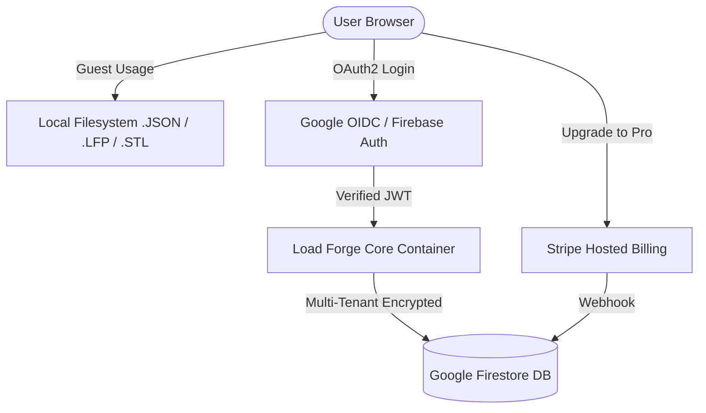

# Load Forge Suite · Comprehensive System Architecture, Ecosystem & Strategy Manual

**Document ID:** `DOC-LF-SUITE-FULL-SPEC-001`  
**Specification Version:** `1.3.0`  
**Last Updated:** `2026-08-30`  
**Target Domain:** Electroacoustic Simulation, Hardware Metrology, Parametric CAD & Micro-SaaS  
**Intended Audience:** Engineering Team, AI Coding Assistants (LLMs), System Architects  

---

## 1. Executive Summary & Suite Vision

The **Playloud Acoustic Forge Suite** is an integrated, end-to-end electroacoustic engineering ecosystem. It replaces the fragmented, legacy audio workflow (WinISD, Hornresp, BassBox Pro, manual DATS software, CAD plugins) with a modern, continuous digital pipeline:

```text
┌──────────────┐         ┌──────────────┐         ┌──────────────┐         ┌──────────────┐
│   METROLOGY  │         │  SIMULATION  │         │ OPTIMIZATION │         │ FABRICATION  │
│   Z_bench    │ ───►    │  Load Forge  │ ───►    │  Bass Match  │ ───►    │  Port CAD &  │
│ (DATS V3 HW) │ (Cloud) │ (Non-Linear) │         │ (10k+ Scrape)│         │ Flare Forge  │
└──────────────┘         └──────────────┘         └──────────────┘         └──────────────┘
```

1. **Hardware Measurement (`Z_bench`)**: Measures physical raw loudspeaker drivers using Dayton Audio DATS V3 hardware, yielding real complex impedance $Z(f)$ and derived Thiele/Small parameters.
2. **Cloud Bridge**: Slashes manual data entry by publishing measured parameters directly into Google Cloud Firestore and local catalog databases.
3. **Simulation & Non-Linear Analysis (`Load Forge`)**: Solves lumped electroacoustic circuits across 10+ enclosure topologies, estimating small-signal SPL, cone excursion $X(f)$ vs $X_{\max}$, port air velocity $v_{\text{air}}$, port compression, and MIL/MOL limits.
4. **Market Optimizer (`Bass Match`)**: Explores a Pareto front over 10,000+ live crawled drivers to automatically match the best driver for target volume, extension, budget, and acoustic load.
5. **Parametric Digital Fabrication (`Port CAD` & `Flare Forge`)**: Generates 2D technical SVG blueprints and watertight 3D STL meshes with constant normal wall thickness for additive manufacturing (3D printing).

---

## 2. Deep Component Architecture

```text
========================================================================================
                                PLAYLOUD FORGE ECOSYSTEM
========================================================================================

 ┌────────────────────────────────────────────────────────────────────────────────────┐
 │  1. METROLOGY LAYER: Z_bench (Port 8502)                                           │
 │  • Hardware: Dayton Audio DATS V3 (TI PCM2900C 16-bit 48kHz USB Audio Codec)       │
 │  • Core: dats_core.py (Swept sine, 2-step calibration, added mass TS derivation)   │
 │  • Bridge: load_forge_bridge.py (Firestore REST API & catalog_proprietario sync)   │
 └─────────────────────────┬──────────────────────────────────────────────────────────┘
                           │ 1-Click Sync (Google Firestore / JSON)
                           ▼
 ┌────────────────────────────────────────────────────────────────────────────────────┐
 │  2. SIMULATION & CAD LAYER: Load Forge (Port 8501)                                 │
 │  • UI Layer: ui_app.py (Streamlit Dark & Emerald Design System, Plotly Cyber)     │
 │  • Acoustic Facade: src/acoustics.py (Public stable API contract)                 │
 │  • Core Physics Engine: src/engine.py (Lumped acoustic models, MIL/MOL limits)     │
 │  • Port CAD & STL: src/port_cad.py (2D Normal offsets, constant wall 3D meshes)    │
 │  • Preset Database: src/presets.py (Unified multi-tier driver catalog)             │
 │  • Market Crawler: tools/autonomous_crawler_daemon.py (Continuous 20+ store hunt)  │
 └─────────────────────────┬──────────────────────────────────────────────────────────┘
                           │ Shared Acoustic Geometry
                           ▼
 ┌────────────────────────────────────────────────────────────────────────────────────┐
 │  3. HORN & WAVEGUIDE LAYER: Flare Forge (Streamlit Web)                            │
 │  • Expansions: Tractrix, Le Cléac'h, OS-SE / ATH, Salmon Hypex, Exponential        │
 │  • Manufacturing: Adapter flanges, multi-part sliced STL for 3D printing           │
 └────────────────────────────────────────────────────────────────────────────────────┘
```

---

### Module 1: `load_forge` (Acoustic Simulator & Optimizer)

#### A. Core Engine Physics (`src/engine.py` & `src/acoustics.py`)
- **Circuit Modeling**: Lumped electro-mechano-acoustical parameter analogies. Solves acoustic impedance $Z_a(s)$, diaphragm velocity $U_d(s)$, and port volume velocities $U_p(s)$ via Laplace-domain complex matrix equations.
- **Topologies Supported as Peers**:
  - `DCCAV`: Double Cavity Coupled Asymmetric Reflex in series ($V_{b1} \parallel \text{Port}_1 \to V_{b2} \parallel \text{Port}_2$).
  - `Bass Reflex`: Conventional vented box with end-corrected Helmholtz resonance.
  - `Acoustic Suspension / Sealed`: Closed air spring compliance $C_{ab}$.
  - `Infinite Baffle`: Ideal isolated rear radiation ($V_b \to \infty$).
  - `Bandpass 4th, 6th, and 8th Order`: Multi-chamber resonant bandpass filters (including triple-chamber 8th order).
  - `Passive Radiator`: Dual-mass resonant system with suspension compliance and losses.
  - `Distributed Waveguides / MLTL`: Mass-loaded transmission lines and quarter-wave pipes.
- **Non-Linear Limits & Power Ratings**:
  - **MIL (Maximum Input Level)**: Frequency-dependent voltage limit defined by thermal power $P_e$ and mechanical displacement limit $X_{\max}$.
  - **MOL (Maximum Output Level)**: Real maximum acoustic output in dB SPL @ 1m at the MIL boundary.
  - **Port Air Velocity & Chuffing Threshold**: Calculates peak linear air velocity $v_{\text{air}} = \frac{|U_p|}{S_p}$. Flags turbulence and port compression when $v_{\text{air}} > 15\text{–}20\text{ m/s}$.

#### B. Parametric Port CAD & 3D STL Engine (`src/port_cad.py`)
- **Normal Offset Geometry**: Implements `compute_normal_offset_profile()` calculating true outward unit normal vectors $\hat{n} = \left(-\frac{dr}{\text{norm}}, \frac{dz}{\text{norm}}\right)$. Guarantees exact uniform normal wall thickness $t_{\text{wall}}$ across flared/curved surfaces (Aeroport, Hourglass, double-flared).
- **Export Outputs**: Technical 2D SVG blueprints with dimensions, and watertight 3D binary STL meshes ready for direct slicer import (Bambu Studio, PrusaSlicer, OrcaSlicer).

#### C. Autonomous Catalog & Price Harvester (`tools/autonomous_crawler_daemon.py`)
- **Continuous Harvesting**: Background daemon collecting driver T/S data and live market prices from 20+ international distributors (Thomann, Parts Express, Madisound, Blue Aran, TLHP, SoundImports, etc.).
- **Validation Pipeline**: Checks physical coherence ($F_s, Q_{ts}, V_{as}, M_{ms}, C_{ms}, B\cdot l$), reconciles effective radiating area $S_d$ vs nominal frame size, and deduplicates identical SKUs.

---

### Module 2: `z_bench` (DATS V3 Hardware Metrology Lab)

#### A. Hardware Interfacing & Signal Processing (`dats_core.py`)
- **Hardware Integration**: Interfaces directly with the Dayton Audio DATS V3 hardware (Texas Instruments PCM2900C stereo 16-bit 48kHz audio codec) via Python `sounddevice`.
- **2-Step Calibration**:
  1. *Step 1 (Shorted Leads)*: Measures residual contact and clip lead resistance $R_{\text{leads}}$ (typically $0.05\text{–}0.30\ \Omega$).
  2. *Step 2 (1 k$\Omega$ Reference)*: Computes complex transfer function correction $H_{\text{cal}}(f)$ across the audio spectrum (10 Hz – 20 kHz) to linearize channel response.
- **Synchronous Swept Sine**: Emits a logarithmic sine sweep at nominal fixed level ($-2.8\text{ dBFS}$) and performs synchronous deconvolution to extract complex impedance $Z(f) = R(f) + jX(f)$.
- **Parameter Derivation**:
  - *Free Air*: $F_s$, $R_e$, $Q_{ms}$, $Q_{es}$, $Q_{ts}$, $Z_{\max}$, $L_e @ 1\text{kHz}$, $L_e @ 10\text{kHz}$, $f_1, f_2$ (-3dB points).
  - *Added Mass Method*: Uses calibrated mass (manual grams or official EUR/USD coins) to derive mechanical moving mass $M_{ms}$, compliance $C_{ms}$, equivalent volume $V_{as}$, force factor $B\cdot l$, mechanical resistance $R_{ms} = \frac{2\pi F_s M_{ms}}{Q_{ms}}$, efficiency $\eta_0$, and reference sensitivity (dB SPL 1W/1m).

#### B. Cloud & Local Bridge (`load_forge_bridge.py`)
- Direct REST publishing to Google Cloud Firestore (`driver_presets` collection in `civic-radio-502611-i8`).
- Atomic in-place update/append to Load Forge's local `catalog_proprietario.json` with `.pkl` cache invalidation.

---

### Module 3: `flare_forge` (Acoustic Horn & Waveguide Generator)

- **Expansion Profiles**: Tractrix, Le Cléac'h, OS-SE / ATH (Oblate Spheroidal with Superellipse roll-over), Salmon Hypex, Exponential, Conical, Iwata.
- **Manufacturing Outputs**: Parametric driver mounting flanges, adapter rings, sliced assemblies for small 3D printer beds, DXF flat patterns, and 3D STL models.

---

## 3. Product Tiering & Commercial Model

```text
┌─────────────────────────────────────────────────────────────────────────┐
│                          LOAD FORGE SUITE TIERING                       │
├────────────────────────────────────┬────────────────────────────────────┤
│         FREE TIER (GUEST)          │        PRO TIER (SUBSCRIBER)       │
│      Frictionless & Unlimited      │      Metered / Compute-Heavy       │
├────────────────────────────────────┼────────────────────────────────────┤
│ • 100% Free Box Design Simulator   │ • Everything in Free               │
│   (All 10+ acoustic topologies)    │ • High / Unlimited Bass Match      │
│ • Full Non-Linear MIL/MOL Metrics  │   Search Quota (e.g. 500/mo)       │
│ • 3D STL & 2D CAD Export (Free)    │ • Full 10,000+ Live Market Crawler │
│ • Local JSON Import/Export (.lfp)  │   Pricing & Pareto Value Ranking   │
│ • 5 Free Bass Match Searches / Mo  │ • Google Cloud Firestore Sync      │
│ • Z_bench Open-Source Desktop HW   │ • Priority Parallel Workers        │
└────────────────────────────────────┴────────────────────────────────────┘
```

### Strategic Logic:
1. **Zero Friction Top-of-Funnel**: `Box Design` and `STL Export` are free without login. This replaces WinISD and creates viral organic adoption among DIY builders and 3D printing communities.
2. **Metered High-Value Feature (`Bass Match`)**: Searching 10,000+ scraped drivers with multi-variable Pareto optimization requires heavy compute and delivers immediate commercial value (saving hours of manual research). This is gated behind a monthly credit quota.
3. **Credit Quotas**:
   - Free account: 5 free searches / month (requires Google Auth to anchor UID).
   - Pro tier: €9.00 / month (or €79.00 / year) for 500 searches/mo + cloud sync.
   - Refill pack: €5.00 for 50 on-demand searches.

---

## 4. Zero-Liability Data & Privacy Architecture



1. **No Passwords Stored**: 100% delegated to Google OIDC / Firebase Auth. Zero password hashes or recovery databases maintained on application servers.
2. **No Financial Data**: Payment processing, invoicing, and EU VAT compliance handled completely by Stripe Checkout and Stripe Customer Portal.
3. **Local-First Default**: Free users save projects directly to their local disk (`.lfp` JSON). The server writes zero user project data to persistent disks for guest sessions.
4. **Isolated Multi-Tenant Cloud**: Pro users store project state under sandboxed Firestore paths (`/users/{uid}/projects/{project_id}`) with database-level security rules enforcing strict UID isolation.

---

## 5. Technical Stack & Governance Standards

- **Language & Runtime**: Python 3.10+ (macOS / Linux / Containerized Debian).
- **Frameworks**: Streamlit (Dashboard UI), Plotly (Dark & Emerald Vector Graphics), NumPy / SciPy (Numerical Acoustics & Signal Processing), SoundDevice / PortAudio (Audio Hardware IO).
- **Infrastructure**: Google Cloud Run (Containerized, Scale-to-Zero), Google Cloud Firestore (NoSQL Document Store), GitHub Actions (CI/CD).
- **Design System Tokens**:
  - Base Background: `#000000` (Pitch Black)
  - Surface Background: `#0a0f16` (Dark Navy)
  - Elevated Container: `#141b27` (Charcoal)
  - Primary Accent: `#10b981` (Emerald Green)
  - Secondary Curve: `#38bdf8` (Sky Blue)
  - Warning/Alert: `#f59e0b` (Amber)
- **Quality & Versioning Governance (`GOLDEN_STD.md` Spec `v1.2.1`)**:
  - **Mandatory Version Bump per Modification**: Every commit incrementing code must bump SemVer in `VERSION`, `CHANGELOG.md`, `README.md`, create an annotated Git tag `vX.Y.Z`, and push.
  - **Lifecycle Policy**: Currently in **Alpha (`0.x.y`)**. Version `1.0.0` is strictly locked until formal exit from Beta.
  - **Testing Gates**: 186/186 test suite pass requirement before releases (`make test` / `tests/test_all.py`).
