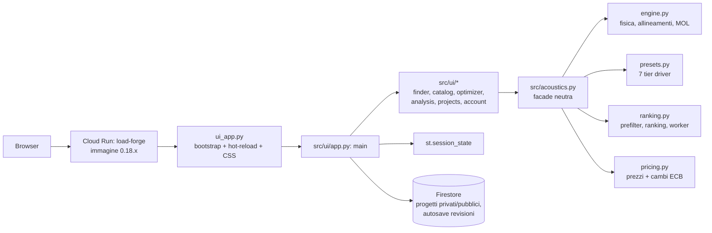
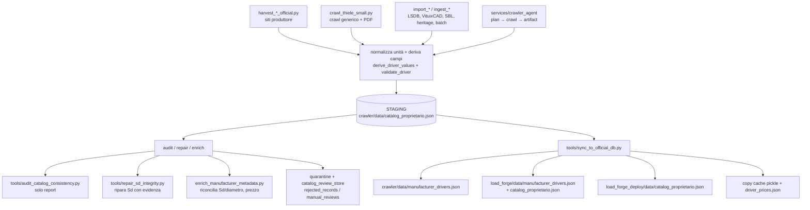
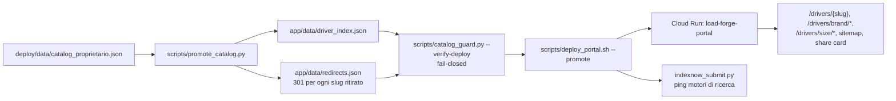
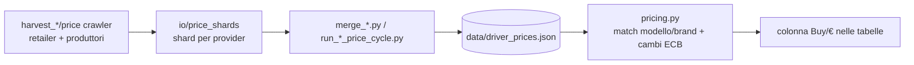

# Architettura e pipeline di Load Forge

Mappa operativa di **tutte** le pipeline del prodotto: runtime, dati, pubblicazione,
release, prezzi, SaaS e operations. Serve a rispondere a una domanda sola:
*«questa informazione, chi la scrive, chi la legge e quando?»*

Tutto ciò che è descritto qui è verificato sul codice e sull'infrastruttura
(`gcloud run services list`, `gcloud firestore databases list`, i tre repo).

## 0. Mappa in 20 secondi

```text
                     ┌──────────────────────────── load_forge_crawler ───────────────────────────┐
 sorgenti web ──────▶│ harvest → normalizza → staging → enrich/audit/repair → sync_to_official_db │
 (produttori,        └───────────────┬───────────────────────────────┬───────────────────────────┘
  retailer, PDF,                    │                               │
  API, forum)                       ▼                               ▼
                            load_forge/data/             load_forge_deploy/data/
                     catalog_proprietario.json            catalog_proprietario.json
                     manufacturer_drivers.json            driver_prices.json
                     driver_prices.json                           │
                     catalog_*.json (tier opzionali)              ▼
                            │                          promote_catalog.py → driver_index.json
                            ▼                          + redirects.json → catalog_guard
                  ┌──────────────────┐                           │
                  │  APP (Streamlit) │                           ▼
                  │  Cloud Run       │                  PORTALE SEO (Cloud Run)
                  │  load-forge      │                  /drivers/*, hub, sitemap, IndexNow
                  └────────┬─────────┘
                           │ progetti, crediti, inviti, telemetria
                           ▼
                  FIRESTORE  (default)  ──▶ release catalogo (drivers/releases/active_release)
                           ▲                     ▲
                           │                     │
                  PORTALE + WEBHOOKS      promote_catalog_release.py
                  (Stripe, inviti)        (dry-run → --commit)
```

## 1. I tre repository e i loro confini

| Repo | Ruolo | Possiede (autorità) | Scrive |
|---|---|---|---|
| `load_forge` | App Streamlit + SaaS + tool runtime | UI, motore acustico, `tools/` di import/audit/prezzi/migrazione | `data/*.json` runtime, Firestore (progetti, account, release catalogo) |
| `load_forge_crawler` | Harvest e staging | **Catalogo sorgente** (`data/catalog_proprietario.json`), policy di release | staging + sincronizzazione verso gli altri due repo, release immutabili |
| `load_forge_deploy` | Sito pubblico + SEO | **URL contract** (`app/data/driver_index.json`, `redirects.json`) | portale, sitemap, redirect, IndexNow |

Regola d'oro, già scritta negli `AGENTS.md`:

- il **catalogo** nasce nel crawler e si propaga (mai modificare a mano la copia in `load_forge/data`);
- gli **slug pubblici** nascono solo da `promote_catalog.py` nel repo deploy (mai a mano);
- le **release Firestore** solo da `promote_catalog_release.py` con `--approved-by` e `--commit`.

## 2. Pipeline RUNTIME (app Streamlit)



Dettagli che contano:

- **Entry point**: `ui_app.py` è sottile: path setup, `importlib.reload` di `src/acoustics` e di
  ogni modulo `src/ui/*`, CSS, re-export e `ui.app.main()`. In Streamlit il processo è long-lived:
  per questo esistono le regole di hot-reload e le cross-reference qualificate
  (`_finder._run_find_driver_search`).
- **Tier dei driver** (`presets.py::_external_tiers`, in ordine di priorità):
  built-in `DRIVER_PRESETS` → **Firestore** (`driver_presets`, misure Z-Bench) →
  **LSDB** → **manufacturer** (`data/catalog_proprietario.json`) → VituixCAD →
  Speaker Box Lite → ZTZ. Per un utente non-admin LSDB/VituixCAD/Speaker Box Lite
  sono nascosti.
- **Refresh a runtime**: `check_dynamic_catalog_freshness()` (TTL 60 s) rilegge la
  sola collezione Firestore `driver_presets` e ricontrolla la mtime del catalogo
  manufacturer su disco. **Non** esiste un percorso che porta il catalogo Firestore
  `drivers` nell'app: il catalogo manufacturer è **cablato nell'immagine**
  (`Dockerfile`: `COPY data/catalog_proprietario.json`) → *un fix dati richiede
  rebuild + deploy*.
- **Cache**: `*.cache.pickle` per i tier esterni e snapshot Firestore, versionati
  (`_PRESET_CACHE_VERSION`). Se cambi come si costruiscono i record, bumpa il
  versionamento o i processi long-lived continuano a servire la versione vecchia.
- **Worker del Finder**: `ranking.rank_candidate_row` gira in un `ProcessPoolExecutor`
  (fallback a thread); la revisione `FINDER_WORKER_PROTOCOL_REVISION` serve a
  rifiutare worker stantii.
- **Output utente**: session state, autosave progetti su Firestore
  (`tenants/{tid}/projects`, revisioni, trash), export CSV, backup `.lfp`.

## 3. Pipeline DATI / CATALOGO (crawler → cataloghi)



- **Filtro di pubblicazione**: `tools/catalog_ingestion.allowed_records()` esclude
  quarantena e radiatori passivi → è il motivo per cui la copia
  `load_forge/data/catalog_proprietario.json` ha **10.761** righe mentre lo staging
  del crawler ne ha **11.047**. Per le release Firestore si usa **lo staging**.
- **Chi comanda**: il crawler. `load_forge/data/*` e `deploy/data/*` sono copie
  rigenerate: una modifica fatta solo lì viene sovrascritta al prossimo sync.
- **Audit periodico**: `tools/audit_catalog_consistency.py` (load_forge) scrive
  `data/catalog_consistency_audit.json`; `repair_sd_integrity.py` (crawler) ripara
  solo con evidenza indipendente e produce `data/sd_integrity_repair_report.json`.

## 4. Pipeline PUBBLICAZIONE / SEO (deploy)



- `driver_index.json` e `redirects.json` **nascono insieme** (una sola snapshot):
  è il contratto che impedisce i 404 sulle pagine già indicizzate.
- `catalog_guard.py --verify-deploy` è il preflight *fail-closed* usato anche da
  `deploy_portal.sh` prima di `gcloud run deploy`.
- Il portale serve anche pagine non-driver: `/subwoofer-box-calculator`,
  `/p/{project_id}`, `/alpha-gate`, `/app`, API `/api/v1/*` (waitlist, port
  calculator, bass-match-lite, track).

## 5. Pipeline RELEASE Firestore (catalogo runtime)

```mermaid
flowchart LR
  C[candidato: crawler staging] --> V[promote_catalog_release.py<br/>validate fs/re/qts]
  V -->|ok o --drop-invalid| W[promote_release]
  W --> R1[(releases/{release_id})]
  W --> R2[(drivers/{id o model})]
  W --> R3[(catalog_metadata/active_release)]
  R3 --> APP[consumatori: portale/runtime]
  RB[--rollback] --> R3
```

- Gate: `--approved-by` obbligatorio, dry-run di default, `--commit` per scrivere.
- Il promoter **non** tocca la Streamlit (vedi §2): alimenta il catalogo runtime
  del progetto (`drivers`/`releases`/`active_release`).
- I record che non passano la validazione abortiscono la release; `--drop-invalid`
  li omette e ne registra i nomi in `metadata.omitted_invalid_drivers`.

## 6. Pipeline PREZZI



- Il ciclo periodico locale è un agente **launchd**:
  `com.loadforge.soundimports-prices` → `tools/run_price_enrichment_cycle.py
  --window-runtime 900`, ogni **6 ore**.
- I prezzi sono opzionali: se mancano, la UI mostra `None` e il ranking
  «Best value» li esclude.

## 7. Pipeline SaaS / GESTIONE

| Pipeline | Chi la esegue | Dove scrive |
|---|---|---|
| Login/registrazione, inviti beta | `load-forge-portal` (`app/auth/invites.py`) | Firestore `users`, `tenants`, `credentials`, `growth_invites` |
| Crediti e piani | app + portale (`src/saas.py`, `src/billing.py`) | `tenants`/account su Firestore |
| Pagamenti | **Stripe** (checkout) → `load-forge-webhooks` (`webhooks/main.py`) | eventi → crediti/abbonamento |
| Progetti utente (privato) | app Streamlit (`src/storage/private_store.py`) | `tenants/{tid}/projects/…` + `revisions` |
| Progetti pubblici/community | app + portale (`public_store.py`) | `public_projects/{id}` + `versions` |
| Telemetria/growth | portale (`app/growth_store.py`) | `growth_telemetry` |
| Catalogo staging/review | pipeline dati | `ingestion_runs`, `catalog_candidates`, `validation_results`, `rejected_records` |
| Radiatori passivi | release dedicate | `passive_radiators`, `passive_radiator_releases` |
| Manutenzione catalogo in-app | workspace *Catalog Maintenance* (solo admin) | scritture esplicite sul catalogo con `tools/repair_verified_catalog_records.py` |

## 8. Pipeline OPS / INFRA

| Ambito | Strumento | Note |
|---|---|---|
| Provisioning IAM/DB | `load_forge/infra/setup_multi_database_iam.sh` | target multi-database (non ancora applicato, §9) |
| Backup / PITR | `infra/backup_schedules.sh` + runbook | `docs/runbooks_multi_database_ops.md` |
| Migrazioni dati | `tools/migrate_private_data.py`, `migrate_public_projects.py`, `adopt_guest_projects.py` | sempre dry-run prima |
| Audit catalogo | `tools/audit_catalog_consistency.py`, `catalog_units_review.json` (crawler) | read-only |
| Monitoraggio locale | `tools/catalog_stats_report.py --interval 180`, `driver_count_watchdog.py`, log crawler in `data/*.log` | processi di sviluppo |
| Build/deploy app | `docs/deploy-cloudrun.md` (`gcloud builds submit` + `gcloud run services update --image`) | immagine `load-forge:0.18.x` |
| Deploy portale | `deploy/scripts/deploy_portal.sh --promote` | include preflight URL + IndexNow |
| Qualità | `make test`, `python tests/test_all.py`, `tests/test_crawler_all.py`, AppTest Streamlit | vedi `CHANGELOG.md` per i conteggi |

## 9. Stato reale vs architettura target

Questa è la parte che genera confusione: la documentazione descrive il target,
l'infrastruttura attuale è più semplice.

| Tema | Target documentato | Realtà verificata |
|---|---|---|
| Database Firestore | 4 DB separati: `lf-private`, `lf-public`, `lf-catalog-runtime`, `lf-catalog-staging` | **un solo DB `(default)`** nel progetto `civic-radio-502611-i8`; le collezioni di tutti i domini convivono lì |
| Esecuzione crawler | Crawler agent come Cloud Run Job + Scheduler | nessun job/scheduler deployato: il daemon gira **in locale** (`make run-daemon`, launchd per i prezzi) |
| Dati del catalogo nell'app | «cloud catalog» | file cablato nell'immagine; da Firestore arriva solo `driver_presets` (Z-Bench) |
| Servizi Cloud Run | — | `load-forge` (Streamlit), `load-forge-portal` (SEO/portale), `load-forge-webhooks` (Stripe) |

Implicazioni pratiche:

1. **Un fix ai dati non è live finché non ridisplieghi l'app** (rebuild immagine →
   `gcloud run services update --image`). La release Firestore non la raggiunge.
2. **I nomi `lf-*` nei runbook non esistono**: passare `--database "(default)"`
   a qualunque tool che parli con Firestore.
3. **Chi scrive su Firestore deve avere un target esplicito**: un tool che si
   accontenta del default in-memory può "riuscire" senza scrivere nulla
   (era il caso del promoter, ora bloccato).

## 10. Cheat-sheet comandi

| Voglio… | Comando | Repo |
|---|---|---|
| far girare l'app | `make run` | load_forge |
| test completo / fast | `python tests/test_all.py [--fast]` | load_forge |
| test crawler | `python -m unittest discover -s tests` | load_forge_crawler |
| crawl T/S generico | `python tools/crawl_thiele_small.py --sitemap … --output …` | load_forge_crawler |
| audit del catalogo | `python tools/audit_catalog_consistency.py` | load_forge |
| riparare `Sd` provati | `python tools/repair_sd_integrity.py [--apply]` | load_forge_crawler |
| propagare il catalogo | `python tools/sync_to_official_db.py` | load_forge_crawler |
| ricostruire slug+redirect | `python scripts/promote_catalog.py [--dry-run]` | load_forge_deploy |
| verificare l'URL contract | `python scripts/catalog_guard.py --verify-deploy` | load_forge_deploy |
| pubblicare una release Firestore | `python tools/promote_catalog_release.py --candidate … --release-id … --approved-by … [--drop-invalid] [--commit]` | load_forge |
| ridispliegare l'app | `gcloud builds submit --tag …/load-forge:0.18.x` + `gcloud run services update load-forge --image=…` | load_forge |
| prenotare un rollback app | `gcloud run services update-traffic load-forge --to-revisions <rev-precedente>=100` | — |

## 11. Punti fragili noti

- Catalogo **dentro l'immagine** → ogni correzione dati costa un rebuild e un
  deploy; una directory montata o un fetch a runtime sarebbero più rapidi.
- Il **portale** e l'**app** leggono lo stesso file da due copie diverse: se il
  sync non viene eseguito, i due lati divergono (il guard SEO non se ne accorge
  finché il catalogo del deploy non cambia).
- I tool che parlano con Firestore **non condividono un unico resolver di
  configurazione**: ogni tool deve fare il check esplicito di progetto/database.
- Il 70–115 % sul rapporto diametro/`Sd` produce falsi positivi su driver con
  sospensioni larghe: gli avvisi `Size/Sd` vanno letti, non obbediti.
